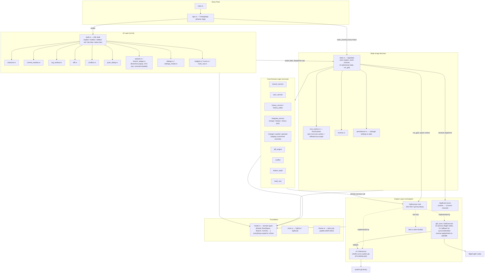

# TurboGit Architecture

TurboGit is a desktop Git client built as a single Rust crate on `eframe`/`egui`.
It follows a strict three-layer separation: the **UI layer never calls git
directly** — all git work goes through an engine seam (`GitExecutor`) executed
on worker threads, with results delivered back to the UI thread over a channel.

## High-Level Diagram

## Layer Responsibilities

### 1. Entry (`src/main.rs`, `src/app.rs`)
- `TurbogitApp` implements `eframe::App`. Each frame it:
  1. Applies dark-only theme tokens (`theme::configure_style`, ADR-0003).
  2. Drains worker-thread `AppEvent`s from the channel (`state.drain_events()`).
  3. Renders one full frame via `ui::render`.
- Launch flow (ADR-0004): a project dir enters the shell directly; no dir lands
  on the Welcome screen. Wires the native folder-picker seam.

### 2. UI (`src/ui`)
- IntelliJ-style IDE shell composed in `shell::render`: 38px topbar, 34px
  toolbar, 48px sidebar rail, 32px tab strip, ~24px status bar. Global shortcut
  dispatch lives here (five frozen shortcuts, ADR-0009).
- Central body routes between Welcome placeholder and active tool windows
  (Commit, Log). Floating surfaces render on top each frame: Branches popup,
  VCS operations popup, command palette, dialogs, push dialog, confirm prompts,
  Settings modal, and toast.
- Reads from `AppState`; never calls git directly.

### 3. State & App Services
- `state.rs` — `AppState` is the hub: owns the `Arc<dyn GitExecutor>`, the
  multi-root model, canonical settings, the crossbeam event channel, and all
  UI-only ephemeral state. Long ops are dispatched to worker threads via
  `AppState::run_git`; the pump (`drain_events`) is on `AppState` so headless
  test harnesses get production parity.
- `root_caches.rs` — per-root caches keyed by `RootId`, invalidated by op-scope
  (`Affected`) so post-op refreshes stay narrow.
- `persistence.rs` — serializes settings/state under `.turbogit/`.

### 4. Core domain logic (`src/core`)
Pure-ish services over the engine seam:
| Module | Responsibility |
|---|---|
| `branch_service` | branch create/rename/delete/checkout flows |
| `sync_service` | fetch/pull/push orchestration |
| `history_service` / `history_editor` | log queries; interactive rebase plans |
| `integrate_service` | merge / rebase / cherry-pick incl. abort/continue |
| `changes` / `partial` / `granular` | staging, selected-file and hunk-level commits |
| `diff_engine` | diff computation/normalization |
| `conflict` | conflict detection & resolution state |
| `shelve_stash` | stash/shelve operations |
| `multi_root` | root discovery and multi-repo scanning |

### 5. Engine (`src/engine`) — the git boundary
- `GitExecutor` is the **only** thing that talks to git. All methods are
  synchronous; callers run them on worker threads so the UI never blocks.
- Implementations:
  - `cli::CliExecutor` — shells out to system `git`; handles **all mutating ops**.
  - `git2_exec::Git2Executor` — in-process libgit2 for supported reads, falling
    back to the CLI for sync/credential ops, reverse patch apply, intent-to-add,
    and diffs libgit2 can't express. Selected via `build_executor(settings)`
    behind the backend setting (ADR-0001).
  - `fake::FakeExecutor` — test double for headless integration tests.
- `AppEvent` is the transport from worker threads back to the UI thread
  (`StatusScanned`, `LogLoaded`, `DiffReady`, `OpCompleted { affected }`, …).

### 6. Foundation
- `model.rs` — domain types (`RootId`, `RootStatus`, `Branch`, `Commit`,
  `Change`, …). Every mutable git state is scoped to a `Root`; there is no
  global "the repository". Types are `Clone + Debug + Serialize/Deserialize`.
- `error.rs` — `TgError` / `TgResult` used across all layers.
- `theme.rs` — design tokens / dark-only palette.

## Threading Model

## Key Architectural Decisions

| ADR | Decision |
|---|---|
| ADR-0001 | Engine seam: `GitExecutor` trait; libgit2 vs CLI selectable by settings |
| ADR-0003 | Dark-only theme tokens |
| ADR-0004 | Launch flow: dir → shell, none → Welcome |
| ADR-0006 | Batch push covers every root; per-root targeting filters preview only |
| ADR-0009 | Five frozen global shortcuts dispatched in the shell |

## Testing Architecture

Headless integration tests in `tests/` create temporary repositories with `tempfile`, require `git` on `PATH`, and drive the real `AppState` plus a fake or CLI engine — same event pump path as production, giving harness/production parity.
