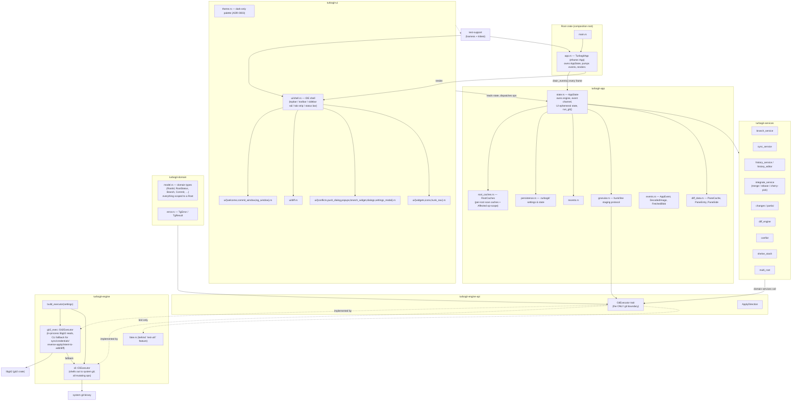
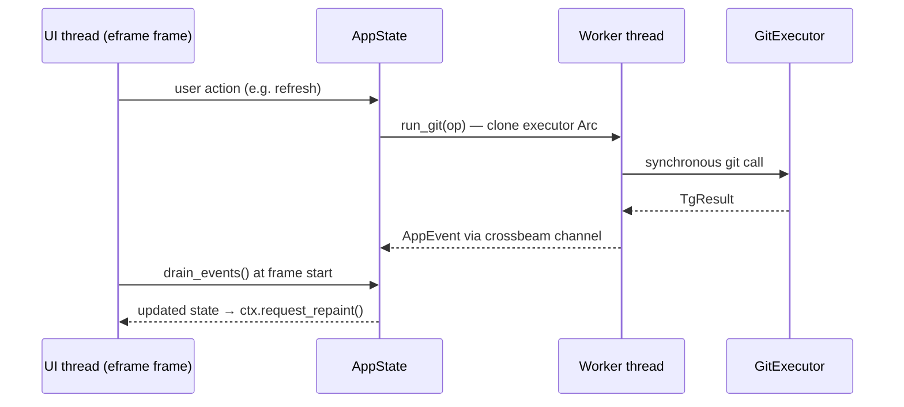

# TurboGit Architecture

TurboGit is a desktop Git client on `eframe`/`egui`, split into one Cargo crate
per layer. It keeps a strict separation: the **UI layer never calls git
directly** — all git work goes through an engine seam (`GitExecutor`) executed
on worker threads, with results delivered back to the UI thread over a channel.

## Workspace Layout

| Crate | Responsibility | Depends on |
|---|---|---|
| `turbogit-domain` | `model` + `error`; the leaf | `serde`, `chrono`, `thiserror` |
| `turbogit-engine-api` | the `GitExecutor` port, `ApplyDirection` | domain |
| `turbogit-engine` | the adapters, the factory, the fake | domain, engine-api, `git2` |
| `turbogit-services` | pure domain services over the port | domain, engine-api |
| `turbogit-app` | `AppState`, worker dispatch, events, caches, persistence, granular | domain, engine-api, engine, services |
| `turbogit-ui` | `theme` + all of `ui/` | app, domain, engine-api, services |
| `test-support` | headless harness + kittest helpers | domain, engine-api (+ `harness` feature) |
| `turbogit` (root) | `main.rs`, `app.rs` — the composition root | app, ui, `eframe`, `rfd` |

Dependencies flow strictly downward:

```
domain ← engine-api ← {engine, services} ← app ← ui ← root
```

The root package carries no domain code — only `main.rs` and the `app.rs`
eframe shell that composes `AppState` with `turbogit_ui::ui`.

## High-Level Diagram



### One sanctioned impurity

`AppState` constructs its own engine: `launch_in` and `rebuild_executor`
(`turbogit-app/src/state.rs:402,466,517`) call `turbogit_engine::build_executor`,
so `turbogit-app → turbogit-engine` is a real edge rather than the clean
`app → port` flow the rest of the graph follows.

The textbook fix is injecting `Arc<dyn GitExecutor>` from the composition root.
It would instead change constructor signatures used by ~20 test call sites, and
nothing needs it today: no test runs the app against the fake. The edge is
accepted and treated as the single composition touchpoint — the only place an
app-side call may reach the adapters.

**Deferred options (do not schedule):** executor injection into `AppState`;
splitting `GitExecutor` into capability traits; decomposing UI state out of
`AppState`. Each is a choice available now that the boundaries exist; none is a
prerequisite for anything else.

## Layer Responsibilities

### 1. Entry (root: `src/main.rs`, `src/app.rs`)
- `TurbogitApp` implements `eframe::App`. Each frame it:
  1. Applies dark-only theme tokens (`theme::configure_style`, ADR-0003).
  2. Drains worker-thread `AppEvent`s from the channel (`state.drain_events()`).
  3. Renders one full frame via `ui::render`.
- Launch flow (ADR-0004): a project dir enters the shell directly; no dir lands
  on the Welcome screen. Wires the native folder-picker seam.

### 2. UI (`turbogit-ui`)
- IntelliJ-style IDE shell composed in `shell::render`: 38px topbar, 34px
  toolbar, 48px sidebar rail, 32px tab strip, ~24px status bar. Global shortcut
  dispatch lives here (five frozen shortcuts, ADR-0009).
- Central body routes between Welcome placeholder and active tool windows
  (Commit, Log). Floating surfaces render on top each frame: Branches popup,
  VCS operations popup, command palette, dialogs, push dialog, confirm prompts,
  Settings modal, and toast.
- Reads from `AppState`; never calls git directly.

### 3. State & App Services (`turbogit-app`)
- `state.rs` — `AppState` is the hub: owns the `Arc<dyn GitExecutor>`, the
  multi-root model, canonical settings, the crossbeam event channel, and all
  UI-only ephemeral state. Long ops are dispatched to worker threads via
  `AppState::run_git`; the pump (`drain_events`) is on `AppState` so headless
  test harnesses get production parity.
- `granular.rs` — the stateful staging protocol (`&mut AppState`, hunk/line
  input resolution, dispatch ordering, completion settlement). Kept in the app
  layer rather than the services crate because it owns UI-facing state.
- `events.rs` — `AppEvent`, `DecodedImage`, `FetchedBlob`: the transport from
  worker threads back to the UI thread.
- `diff_data.rs` — the plain diff-pane data types (`PaneCache`, `PaneEntry`,
  `PaneSide`) and the hunk-nav `Dir`/`EDGE_WINDOW` that `ui/diff.rs` renders.
  Living beside `AppState` keeps the app crate egui-free.
- `root_caches.rs` — per-root caches keyed by `RootId`, invalidated by op-scope
  (`Affected`) so post-op refreshes stay narrow.
- `persistence.rs` — serializes settings/state under `.turbogit/`.
- `recents.rs` — the global recent-projects file (ADR-0005).

### 4. Services (`turbogit-services`)
Pure-ish services over the engine seam; no egui, no `AppState`:
| Module | Responsibility |
|---|---|
| `branch_service` | branch create/rename/delete/checkout flows |
| `sync_service` | fetch/pull/push orchestration |
| `history_service` / `history_editor` | log queries; interactive rebase plans |
| `integrate_service` | merge / rebase / cherry-pick incl. abort/continue |
| `changes` / `partial` | staging, selected-file and hunk-level commits |
| `diff_engine` | diff computation/normalization |
| `conflict` | conflict detection & resolution state |
| `shelve_stash` | stash/shelve operations |
| `multi_root` | root discovery and multi-repo scanning |

### 5. Engine
- **`turbogit-engine-api`** — `GitExecutor` is the **only** thing that talks to
  git, plus `ApplyDirection`. ~60 methods, all synchronous; callers run them on
  worker threads so the UI never blocks.
- **`turbogit-engine`** — the adapters and the factory:
  - `cli::CliExecutor` — shells out to system `git`; handles **all mutating ops**.
  - `git2_exec::Git2Executor` — in-process libgit2 for supported reads, falling
    back to the CLI for sync/credential ops, reverse patch apply, intent-to-add,
    and diffs libgit2 can't express. Selected via `build_executor(settings)`
    behind the backend setting (ADR-0001).
  - `fake::FakeExecutor` — test double, exported only behind the `test-util`
    cargo feature so release builds never compile it.

### 6. Domain (`turbogit-domain`)
- `model.rs` — domain types (`RootId`, `RootStatus`, `Branch`, `Commit`,
  `Change`, …). Every mutable git state is scoped to a `Root`; there is no
  global "the repository". Types are `Clone + Debug + Serialize/Deserialize`.
- `error.rs` — `TgError` / `TgResult` used across all layers. Carries no `ron`
  dependency: serialization failures arrive as plain strings from the
  persistence layer, keeping the leaf crate free of format-specific types.

## Threading Model



## Key Architectural Decisions

| ADR | Decision |
|---|---|
| ADR-0001 | Engine seam: `GitExecutor` trait; libgit2 vs CLI selectable by settings |
| ADR-0003 | Dark-only theme tokens |
| ADR-0004 | Launch flow: dir → shell, none → Welcome |
| ADR-0005 | Global recent-projects config |
| ADR-0006 | Batch push covers every root; per-root targeting filters preview only |
| ADR-0009 | Five frozen global shortcuts dispatched in the shell |
| ADR-0013 | Partial staging filters raw diff text |
| ADR-0016 | One crate per layer; the app→engine edge is the single composition touchpoint |

The crate-per-layer split, the sanctioned edge, and the deferred options are
specified in `docs/ddd-subcrate-proposal.md`.

## Testing Architecture

Tests live in the crate they exercise, and span crates only when they must:

- `crates/turbogit-engine/tests/` — engine-level behavior against real repos
  (`engine_golden`, `push_dry_run`, `partial_stage_cli`).
- `crates/turbogit-services/tests/` — service behavior over the fake executor.
- `crates/turbogit-app/tests/` — stateful staging protocol and cache invalidation.
- `crates/turbogit-ui/tests/` — the egui/kittest suites (16 of them) plus the
  screenshot-acceptance suite.
- root `tests/diff_parity.rs` — the one suite that legitimately needs every
  crate: it compares engine diff text against `turbogit_ui::ui::diff::parsed_rows`.
  Only the root has the dependency set to reach both sides.

All of them create temporary repositories with `tempfile`, require `git` on
`PATH`, and drive the real `AppState` plus a fake or CLI engine — the same event
pump path as production, giving harness/production parity. Shared helpers
(`RecordingExecutor`, the kittest shell driver) live in `test-support`, behind
its `harness` feature so a crate that only needs the recording executor never
compiles `egui_kittest`.
