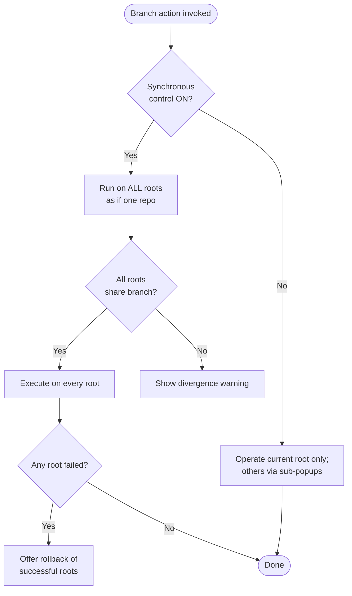
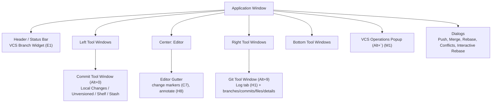
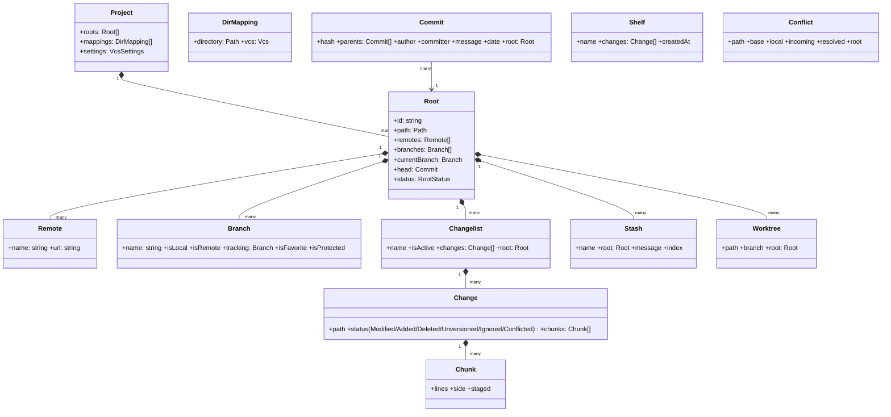

# TurboGit — IntelliJ-Style Git Tool: Product Specification

> **Purpose.** This document is the single source of truth for building a clone of IntelliJ IDEA's Git integration, with first-class support for managing **multiple Git repositories within a single parent project** (multi-root / sub-repositories). It is structured to be consumed directly by a code-generation step: every feature is listed, every user flow is spelled out entry-point → steps → outcome → edge cases, and the data model + architecture sections define the seams between modules.
>
> **Scope.** Desktop-class Git client UX modeled on IntelliJ IDEA 2026.x. Built as a set of cooperating modules over a real Git engine (in-process libgit2 via `git2` as the primary backend behind the `GitExecutor` seam, with the system `git` CLI retained for sync/credential operations and fallback cases), not a toy.
>
> **Status:** v0.1 — initial research-driven draft.

---

## Table of Contents

1. [Product Vision & Goals](#1-product-vision--goals)
2. [Target Personas](#2-target-personas)
3. [Core Concepts & Terminology](#3-core-concepts--terminology)
4. [System Architecture](#4-system-architecture)
5. [Complete Feature Catalog with User Flows](#5-complete-feature-catalog-with-user-flows)
   - A. Repository Setup & VCS Integration
   - B. Multi-Repository (Multi-Root) Management ⭐ headline
   - C. Change Tracking & the Commit Tool Window
   - D. Synchronization (Fetch / Pull / Update / Push)
   - E. Branch Management
   - F. Integrating Changes (Merge / Rebase / Cherry-pick)
   - G. Conflict Resolution
   - H. History & Investigation
   - I. Undo & History Editing
   - J. Shelve & Stash
   - K. Diff Viewer
   - L. Hosting Integration (GitHub / GitLab)
   - M. VCS Operations Popup
   - N. Local History
   - O. Tags
   - P. Ignore Files
   - Q. Settings & Configuration
6. [Multi-Repository Deep Dive](#6-multi-repository-deep-dive-)
7. [UI / UX Structure](#7-ui--ux-structure)
8. [Data Model](#8-data-model)
9. [Build Roadmap](#9-build-roadmap)
10. [Technology Stack (Rust + egui)](#10-technology-stack-rust--egui)
11. [Open Questions](#11-open-questions)

---

## 1. Product Vision & Goals

**Vision.** Reproduce the daily-workflow power of IntelliJ's Git tooling as a standalone, embeddable Git client. The differentiator the user cares about most: a project may own **several Git repositories at once** — a parent repo plus nested roots, submodules, sibling module repos, or worktrees — and the tool presents them as one coherent workspace while still letting you operate on any single root.

**Goals.**
- Parity with IntelliJ's everyday flows: commit, branch, merge, rebase, log, diff, conflict resolution, history editing, stash/shelve.
- First-class **multi-root**: unified log, batch commit/update/push, synchronous *and* per-repo branch control, divergence protection with rollback.
- Visual conflict resolution with a true 3-way merge editor.
- History editing (interactive rebase, amend, squash, fixup, drop, reword) without dropping to the CLI.
- Plugin-friendly architecture so hosting integrations (GitHub/GitLab) are add-ons.

**Non-goals (v1).**
- Replacing the Git engine internals — we build on in-process libgit2 (`git2`) behind the `GitExecutor` seam, delegating to the system `git` CLI where libgit2 falls short.
- A full issue-tracker UI (we integrate, we don't replace).
- Mercurial / Perforce / SVN support (directory-mapping model is designed to allow it later, but v1 is Git-only).

---

## 2. Target Personas

| Persona | What they need |
|---|---|
| **Solo dev** | Fast commit/branch/diff without leaving the editor; safety nets (local history, easy undo). |
| **Team dev** | Push/pull, conflict resolution, PR review, blame, history search. |
| **Multi-repo / monorepo-with-subrepos dev** ⭐ | Manage a parent repo + several nested repos/submodules in one window; batch operations; keep branches in sync across roots or operate per-root. |
| **OSS maintainer** | Fork/clone, PR review, cherry-pick hotfixes across release branches. |

---

## 3. Core Concepts & Terminology

- **Repository root (root).** A directory with its own `.git`. A project may contain many roots.
- **Multi-root project.** A single IDE/workspace project that has more than one registered Git root.
- **Directory mapping.** An association between a project directory and a VCS. Stored in `.idea/vcs.xml` (IntelliJ) / our equivalent. Each root = one mapping.
- **Changelist.** A named, user-organized bucket of local (uncommitted) changes. Exactly one is **active**; new edits land in the active changelist. This is IntelliJ's default model (vs. Git's index).
- **Staging area mode.** Optional alternative UI that mirrors Git's index (Unstaged / Staged sections) instead of changelists.
- **Shelf.** IDE-managed patch store; can shelve specific files/changelists and re-apply many times.
- **Stash.** Git's native stash; whole working-tree diff vs HEAD; re-appliable.
- **Worktree.** A linked working directory sharing one `.git` object store. Each worktree is registered as its own root.
- **Submodule.** A nested repository tracked by a parent at a fixed commit. Registered as a nested root.
- **Synchronous branch control.** A mode where branch operations run on *all* roots at once, as if they were one repo.
- **VCS widget.** The branch indicator in the main window header/status bar.
- **Protected branch.** A branch pattern for which force-push is forbidden.

---

## 4. System Architecture

```mermaid
flowchart LR
  subgraph Engine["Git Engine Layer"]
    GE["Git Executor<br/>(libgit2 via git2 + CLI fallback)"]
    IDX["Log Indexer<br/>(fast history search)"]
  end

  subgraph Core["Core / Domain Layer"]
    VM["VCS Manager<br/>(roots, mappings, status)"]
    MRM["Multi-Root Manager ⭐<br/>(batch ops, sync control)"]
    CHG["Change Tracker<br/>(changelists / staging)"]
    BR["Branch Service"]
    HX["History Service<br/>(log, file history, blame)"]
    INT["Integrate Service<br/>(merge/rebase/cherry-pick)"]
    CF["Conflict Resolver"]
    HE["History Editor<br/>(interactive rebase)"]
    SS["Shelve / Stash Service"]
    SYNC["Sync Service<br/>(fetch/pull/push)"]
  end

  subgraph UI["UI Layer"]
    CTW["Commit Tool Window"]
    GTW["Git Tool Window (Log)"]
    BW["Branch Widget + Popup"]
    DV["Diff / Merge Viewer"]
    POP["VCS Operations Popup"]
    HOST["Hosting Plugins (GitHub/GitLab)"]
  end

  UI --> Core --> Engine
```



**Layering rules (for code generation).**
- The **Engine Layer** is the only thing that talks to git. Everything above is engine-agnostic.
- The **Core Layer** exposes domain operations and state; it must be unit-testable without UI.
- The **UI Layer** binds to Core state and never calls git directly.
- `Multi-Root Manager` wraps single-root services and adds batch + synchronous semantics — single-root code does not know it is multi-root.

---

## 5. Complete Feature Catalog with User Flows

> Format per feature: **What** · **Entry points** · **User flow** · **Outcome** · **Edge cases / multi-root behavior** · **Settings**.

### A. Repository Setup & VCS Integration

#### A1. Create a local Git repository from a project
- **What:** Initialize a new repo at the project root.
- **Entry points:** New Project dialog → "Create Git repository" checkbox; `Git → Enable…`/`VCS → Enable Version Control Integration`; VCS Operations Popup (`Alt+``) → Enable Version Control Integration.
- **Flow:** Choose Git as VCS → IDE runs `git init` at root → registers directory mapping → prompts to share project settings via VCS (Git/Hg only).
- **Outcome:** Empty repo, branch `master`/`main`, files now show VCS status colors.
- **Edge cases:** If git executable missing, prompt to install; auto-detect WSL git on Windows.

#### A2. Clone an existing repository
- **What:** Clone from URL or hosting provider.
- **Entry points:** Welcome screen → Get from VCS; `Git → Clone`; `VCS → Get from Version Control`.
- **Flow:** Choose source (URL / GitHub / GitLab) → authenticate if needed → choose directory → optional **shallow clone** (limit history depth) → Clone → optionally open as project → root mapping auto-set.
- **Outcome:** Working tree at target path, origin remote configured.
- **Edge cases:** Shallow clone can be deepened later via `Git → Unshallow Repository`.

#### A3. Enable version control integration (associate root ↔ VCS)
- **What:** Bind a project root to a VCS.
- **Entry points:** `Alt+`` → Enable Version Control Integration; `VCS → Enable Version Control Integration`.
- **Flow:** Pick VCS from list of enabled plugins → confirm.

#### A4. Directory mappings (per-directory VCS)
- **What:** Map each project directory to a VCS independently (the basis of multi-root).
- **Entry points:** `Settings → Version Control → Directory Mappings`.
- **Flow:** Add mapping → pick Directory → pick VCS (Git) → OK. Change VCS by clicking the VCS column; `None` disables VCS for that dir.
- **Storage:** `.idea/vcs.xml`.
- **Multi-root:** This is exactly how additional roots are registered. See §6.

#### A5. Auto-detect unregistered Git roots
- **What:** Scan project dirs for repos not yet controlled by the IDE; notify.
- **Flow:** On project load/scan → if unregistered `.git` dirs found → notification "Add roots" / "Ignore". Add via notification or pick from greyed list in Version Control settings.

#### A6. Manage remotes
- **What:** Add/edit/remove remote repositories.
- **Entry points:** `Git → Manage Remotes`; project-view right-click → `Git → Repository → Remotes`.
- **Flow:** Add remote (name + URL) → OK. Remotes are reusable across fetch/pull/push.

#### A7. Share project on GitHub / GitLab
- **What:** Create a remote repo from a local project and push.
- **Entry points:** `Git → GitHub/GitLab → Share Project on…`.
- **Flow:** Authenticate → choose repo name, remote name (default `origin`), public/private, description → Share → IDE creates remote, adds remote, commits, pushes initial sources.

#### A8. Shallow clone & unshallow
- **What:** Limit cloned history; deepen later.
- **Flow:** At clone: set depth N. Later: `Git → Unshallow Repository`.

#### A9. Git executable & WSL configuration
- **What:** Point to git binary; supports WSL2 git on Windows; auto-switch for `\wsl$` paths.
- **Entry points:** `Settings → Version Control → Git` → Path to Git executable → **Test**.

---

### B. Multi-Repository (Multi-Root) Management ⭐ HEADLINE

> This is the feature the user emphasized. Full deep-dive in §6; this section is the feature list. "Multi-root" = several Git repositories in one project (parent + nested roots, submodules, sibling module repos, or worktrees).

#### B1. Register multiple Git roots in one project
- **Entry points:** `Settings → Version Control → Directory Mappings` (add a mapping per root); auto-detection of unregistered roots (A5).
- **Flow:** Each `.git`-bearing directory becomes a tracked root with its own status, branches, remotes.
- **Outcome:** The project is now a multi-root project; multi-root UI activates.

#### B2. Per-root status tracking
- **What:** Each root independently reports modified/unversioned/ignored/conflicted files.
- **Flow:** Commit tool window groups changes **per repository** when in multi-root mode; root labels appear next to change sets.

#### B3. Unified Log across roots
- **What:** One log graph mixing commits from all roots.
- **Flow:** Log tab shows all commits; a **colored stripe** on each commit indicates its root (hover → root path tooltip); enable **Show Root Names** to expand a Roots column; filter by root via the Path/Root filter.
- **Outcome:** Cross-repo history visible in one place.

#### B4. Batch operations across roots
- **What:** Commit, Update Project, and Push can run on all roots at once.
- **Flow:** Commit window lists all roots' changes; Update Project updates every root; Push dialog lists all roots with their outgoing commits.

#### B5. Synchronous branch control
- **What:** Run branch operations (checkout, merge, delete, etc.) on **all roots simultaneously**, as if one repo.
- **Entry points:** `Settings → Version Control → Git → Execute branch operations on all roots` (only visible in multi-root projects). On first branch popup in a multi-root project where all roots share branch names, IDE proposes enabling it.
- **Flow:** When enabled, the branch popup lists only **common** local/remote branches; creating/checking out/merging/deleting a branch happens on every root.
- **Compare** shows the standard dialog plus a root selector.

#### B6. Per-repo branch control (asynchronous mode)
- **What:** Operate branches per root independently.
- **Flow:** Branch popup shows current root's branches; other roots accessible as **sub-popups**; "current root" = the root under the selected file, or the editor file's root if nothing selected.

#### B7. Branch divergence warning + rollback
- **What:** If synchronous checkout partially fails (succeeded on some roots, failed on others), offer to **rollback** successful checkouts to prevent divergence. Warn if branches diverged (e.g., one root on `master`, another on `feature`).
- **Flow:** Notification → "Rollback" re-checks successful roots to their previous branch. Rollback offered for checkout, merge, and other branch actions.

#### B8. Push dialog showing all repositories
- **What:** Push Commits dialog lists every root with its outgoing commits.
- **Flow:** Select a root/commit → preview files on the right; selecting an entire repo lists all files across its commits (same file across commits shown once, diff zips changes).

#### B9. Submodule support
- **What:** Nested repos tracked by parent at a pinned commit are registered as nested roots.
- **Flow:** Submodule dirs detected → registered (often needs manual mapping) → operated on like any root; parent sees submodule pointer changes.
- **Note:** IDE does not recurse-register submodules by default — user adds them explicitly.

#### B10. Git worktree support
- **What:** Each worktree dir registered as its own root; create worktrees from the branch popup ("New Worktree from").
- **Flow:** New worktree → appears as root → independent branch/changes; shares object store.

#### B11. Root filtering in Log
- **What:** In multi-root projects, the Path filter shows a **Roots** section; check one or more roots to scope the log.

---

### C. Change Tracking & the Commit Tool Window

#### C1. Local Changes view (changelists)
- **What:** Default model — modified files auto-group into changelists; one active.
- **Entry points:** Commit tool window (`Alt+0`); `Ctrl+K` selects the active changelist for commit.
- **Default changelists:** `Changes` (modified+staged) and `Unversioned Files`.

#### C2. Unversioned files
- **What:** Files in project not yet tracked. Can be added in one step at commit time.

#### C3. Ignored files (.gitignore)
- **What:** Honor `.gitignore`; mark files ignored. See §P.

#### C4. Multiple changelists
- **What:** Create arbitrary named changelists; set one active; new edits go to active, prior edits stay put.
- **Flow:** Right-click changes → Move to Another Changelist; create new; set active.

#### C5. Move changes between changelists
- **What:** Right-click a modified chunk → "Move to Another Changelist"; even split a single file's chunks across changelists.

#### C6. Staging area mode (alternative to changelists)
- **What:** Mirror Git's index with Unstaged/Staged sections.
- **Entry points:** `Settings → Version Control → Git → Enable staging area`.
- **Flow:** Switching modes **preserves** existing changelists (no data loss). Stage whole file (`Ctrl+Alt+A`) or a chunk via gutter marker, or stage granular lines via 3-way diff (HEAD | Staged | Local). Staged changes show **hollow** gutter markers.

#### C7. Editor gutter change markers
- **What:** Color-coded gutter markers for added/modified/deleted lines; click marker → inline commit toolbar. Enable via `Settings → VCS → Confirmation → Gutter`.

#### C8. Inline diff in editor
- **What:** Click gutter marker → see diff vs repo; "Commit this change" inline.

#### C9. Commit message field
- **What:** Message input with history button (reuse recent messages), **Amend** toggle (choose which commit to append to), editable pre-push, configurable rules + **Reformat** + commit template (`commit.template`).

#### C10. Advanced commit options (gear / `Ctrl+O`)
- **General:** Author, Sign-off.
- **Pre-commit checks:** Reformat code, Rearrange code, Optimize imports, Cleanup (profile), Update copyright, Check malicious dependencies.
- **Advanced checks:** Analyze code (profile), Check TODO (filter), Run Configuration (tests) — these run *after* commit normally, but *before* commit when using Commit & Push.
- **After commit:** Upload files to server (FTP/SFTP/WebDAV).

#### C11. Pre-commit Git hooks
- **What:** `.git/hooks` run automatically. Disable per-commit (clear "Run Git hooks") or IDE-wide (`Settings → Advanced Settings → VCS → Git → Do not run Git commit hooks`).

#### C12. Partial commits
- **By chunk:** Diff view → check the chunks to include → Commit (rest stays pending).
- **By line:** Diff → right-click line → "Split Chunks and Include Selected Lines into Commit"; or use gutter checkboxes.
- **From editor:** change marker → inline toolbar → message → "Commit this change" (with optional Amend).

#### C13. Amend commit
- **What:** Append staged changes to a chosen local commit instead of a new commit.
- **Flow:** Select files → Amend toggle + chevron → pick commit → Amend Commit.

#### C14. Commit & Push flow
- **Entry points:** `Ctrl+Alt+K`; Commit button dropdown → Commit and Push.
- **Flow:** Commit locally → open Push Commits dialog → review all commits → Push. See §D.

#### C15. After-commit actions
- **What:** Upload committed files to a configured server/group (optional, requires connectivity plugin).

---

### D. Synchronization (Fetch / Pull / Update / Push)

#### D1. Fetch
- **What:** Download remote refs/objects without merging.
- **Entry points:** Branches pane → "Fetch All Remotes"; branch context → "Update Selected" (fetch one branch); VCS widget fetch icon.

#### D2. Pull / Update Project
- **What:** Sync local with remote using configured strategy.
- **Entry points:** `Git → Update Project`; `Ctrl+T`.
- **Strategy:** Merge (`fetch`+`merge`, i.e. `pull --no-rebase`) or Rebase (`fetch`+`rebase`, i.e. `pull --rebase`). Configured in Git settings → Update method.

#### D3. Update branch
- **What:** Pull a single branch.

#### D4. Push (Push Commits dialog)
- **Entry points:** `Ctrl+Shift+K`; `Git → Push`.
- **Dialog contents:** per-root outgoing commits; change preview pane; `Ctrl+Q` for commit info; edit target branch name / "Edit all targets"; author-asterisk for commits by others.
- **No remote?** "Define remote" link.

#### D5. Force push (force-with-lease) + protected branches
- **What:** Push dropdown → Push or **Force push** (`--force-with-lease`). Force push **disabled for protected branches** (configurable patterns).

#### D6. Push tags
- **What:** Checkbox (off by default) → **All** (`--tags`) or **Current Branch** (`--follow-tags`).

#### D7. Push rejected handling
- **Flow:** If working copy outdated → choose update method (Rebase/Merge) → optionally "Remember" (sets auto-update-on-rejected).
- **Multi-root:** Choose "Update all repositories" or only affected ones.

#### D8. Incoming/outgoing commit indicators
- **What:** VCS widget shows blue (incoming) / green (outgoing) arrows next to branch name.

#### D9. Explicit incoming-commit check on remotes
- **What:** Periodically check for unfetched incoming commits; mark branches in popup.
- **Modes:** Auto (HTTP/Git only, not SSH), Always (even SSH), Never (manual).

#### D10. Clean working tree on update
- **What:** When update needs a clean tree, choose **Stash** (git-native, portable) or **Shelve** (IDE patches). Configured in Git settings.

---

### E. Branch Management

#### E1. VCS branch widget
- **What:** Header/status-bar indicator of current branch; click → branch popup. Shows incoming/outgoing arrows.

#### E2. Branches popup
- **What:** Grouped list: Recent branches (≤5), Local, Remote, Tags; directory-grouped when names use `/`.

#### E3. New branch
- **From current:** widget → New Branch; set name, "Checkout branch" option.
- **From selected branch:** New Branch from Selected.
- **From a commit:** Log → right-click commit → New Branch.
- **UX:** name suggestions based on existing local prefixes.

#### E4. Checkout
- **Local:** select → Checkout.
- **Remote as new local:** select remote → Checkout → creates tracking local branch.
- **Name collision (no loss, already tracking):** auto-reset local to remote & checkout. **If local commits could be lost:** offer **Drop Local Commits** or **Rebase onto Remote**.

#### E5. Smart checkout (conflict handling on switch)
- **Clean/no conflict:** immediate checkout + notification.
- **Conflict:** **Force Checkout** (discard local changes) or **Smart Checkout** (shelve → checkout → unshelve; if unshelve conflicts, prompt to merge).

#### E6. Checkout and update
- **What:** Switch + sync with remote in one action.

#### E7. Rename branch
- **Flow:** Rename local only → optionally "Unset upstream" → next push creates/tracks new remote → delete old remote. (Copy name: hover + `Ctrl+C`.)

#### E8. Delete branch
- **Pre:** must checkout another first. Even unmerged branches delete (like `-D`) but notification links to view unmerged commits and to delete the remote.

#### E9. Compare branches
- **With current:** opens tab listing commits in selected not in current; **Swap Branches**; `Ctrl+A` for changed files.
- **With working tree:** Changes window; gray=missing-in-current, green=missing-in-selected, blue=content diff; "Get from Branch" to apply whole file.

#### E10. Favorite branches
- **What:** Starred branches pinned to top; main branch favorited by default. Mark via star, `Space`, or toolbar.

#### E11. Branch grouping & organization
- Recent / Local / Remote / Tags; group by directory; toggle recents/tags.

#### E12. Worktree creation
- **What:** "New Worktree from" a branch.

#### E13. Workspace context restoration per branch
- **What:** "Restore workspace on branch switching" saves/restores open files, run config, breakpoints per branch (IDE switches only).

---

### F. Integrating Changes (Merge / Rebase / Cherry-pick)

#### F1. Merge
- **Quick:** Branches popup → select source → "Merge `<src>` into `<target>`".
- **With options** (`Git → Merge` → Modify options): `--no-ff`, `--ff-only`, `--squash`, `-m`, `--no-commit`, `--no-verify`, `--allow-unrelated-histories`.
- **Conflicts:** prompt to resolve (§G).
- **Local changes would be overwritten:** **Smart merge** (stash → merge → unstash).
- **Abort:** via VCS widget.

#### F2. Smart merge
- **What:** Auto-stash local changes, merge, unstash. (See F1.)

#### F3. Rebase
- **With options** (`Git → Rebase` → Modify options): `--onto`, `--rebase-merges`, `--keep-empty`, `--root`, `--update-refs`, `--autosquash`, "Select another branch".
- **Quick via popup:** "Checkout and Rebase onto `<current>`"; "Rebase `<current>` onto `<selected>`"; "Pull into `<current>` Using Rebase".
- **Abort/Continue:** via VCS widget.

#### F4. Pull into using rebase/merge
- **What:** Remote branch context → fetch + rebase or fetch + merge current onto it.

#### F5. Interactive rebase
- **Entry:** Log → right-click oldest commit in series → "Interactively Rebase from Here"; or `Git → Rebase` → `--interactive`.
- **Actions:** Reorder (↑↓), Pick, Stop to Edit, Reword (double-click), Squash, Fixup, Drop, Reset.
- **Review:** "Rebasing Commits" graph → "Start Rebasing". Pauses surface a notification; resume via `Git → Continue Rebase`.

#### F6. Cherry-pick commit
- **Flow:** Checkout target → Log → find commit (use "Highlight | Non-Picked Commits", "Go to Hash/Branch/Tag") → Cherry-pick toolbar button → resolve conflicts in Commit window → push.

#### F7. Cherry-pick selected changes (partial)
- **Flow:** Commit Details pane → select files → "Cherry-Pick Selected Changes" → choose/create changelist → commit + push.

#### F8. Abort / continue operations
- **What:** VCS widget / status bar → Abort or Continue for merge/rebase/cherry-pick.

#### F9. Get file from branch
- **Flow:** Switch to target → Branches popup → source branch → "Show Diff with Working Tree" → select file → "Get from Branch" → commit.

---

### G. Conflict Resolution

#### G1. Auto-merge non-conflicting changes
- **What:** Non-overlapping changes merge automatically; only same-line conflicts block.
- **Sources of conflict:** pull, merge, rebase, cherry-pick, unstash, apply patch.

#### G2. Conflicts dialog
- **Per file, three options:** **Accept Yours** (keep current branch), **Accept Theirs** (take incoming), **Merge manually**.
- **Bulk:** "Resolve All Simple Conflicts".
- **Re-entry:** If closed, a "Merge Conflicts" node appears in the Commit window with "Resolve Conflicts" / "Abort Merge".

#### G3. 3-way merge editor
- **Panes:** Left = read-only local; Right = read-only repository (incoming); Center = editable result (initially = base revision).
- **Markers:** modified, deleted, added, conflicting lines.

#### G4. Apply non-conflicting changes
- **Buttons:** All / from Left / from Right.

#### G5. Resolve simple conflicts
- **What:** One-click merge for trivial conflicts (e.g., both ends of same line changed) — distinct from "Apply All Non-Conflicting".

#### G6. Per-line accept / ignore
- **Flow:** Accept (arrow) / Ignore (X) per side; right-click conflict in center → "Resolve using Left/Right".

#### G7. Revert conflict resolution
- **What:** Right-click file in Conflicts dialog → "Revert conflict resolution" → back to conflicted.

#### G8. LF / CRLF handling
- **What:** Diff viewer shows line-ending discrepancies; smart warning when committing CRLF; suggests `core.autocrlf` (`true` Win / `input` *nix). Option: `Settings → VCS → Git → Warn if CRLF…`.

#### G9. Merge conflicts node in Commit window
- **What:** During an unfinished merge, conflicting files grouped under a Merge Conflicts node with resolve/abort actions.

---

### H. History & Investigation

#### H1. Git Log tab
- **Panes:** Branches (left), Commits (center), Changed Files (right-top), Commit Details (right-bottom).
- **Graph:** colored branch refs; current-branch commits on light-blue bg; your commits bold; `*` when author ≠ committer; arrows to traverse long branches; `Alt+←/→` parent/child.
- **Multi-root:** colored root stripe per commit; "Show Root Names" expands root column.

#### H2. Log filtering & search
- **Filters:** branch / favorite branches, user, date, path (root + folder for multi-root), search by message/hash/regex.
- **"Go to Hash/Branch/Tag"** (`Ctrl+F` in Log); `Ctrl+L` to focus search; open a **new filtered tab** to preserve filters.

#### H3. Show repository at revision
- **Flow:** Log → commit → "Show Repository at Revision" → Repositories tool window with project snapshot.

#### H4. Compare two commits (versions)
- **Flow:** Select two commits → "Compare Versions" → Changes window of files modified between them; `Ctrl+D` per file.

#### H5. File history (Show History)
- **Entry:** `Git → Selected File → Show History` / context menu "Git → Show History".
- **Features:** per-revision diff (`Ctrl+D`); "Show All Affected Files" (`Alt+Shift+A`); branch filter; rename column; Open on GitHub/GitLab; enable Git Log Indexing.

#### H6. History for selection (line-level)
- **Entry:** editor selection → `Git → Current File → Show History for Selection`. If nothing selected, history for the current line.

#### H7. Directory history
- **What:** History scoped to a folder.

#### H8. Annotate / Git Blame
- **What:** Per-line authorship; accessible from editor gutter / file history.

#### H9. Log indexing
- **What:** Index repos for fast log filtering, precise history, all-branches file history, and Search-Everywhere history search.

#### H10. Open commit on GitHub/GitLab
- **What:** Jump from a commit/file to its web view; editor scrolls to current line.

---

### I. Undo & History Editing

#### I1. Revert commit
- **What:** Create a new commit that inverses a given commit (safe for shared history). Right-click commit in Log → "Revert Commit".

#### I2. Undo last commit
- **What:** Drop the most recent unpushed commit, keeping changes in the working tree.

#### I3. Edit commit message (reword)
- **Entry:** Log → commit → "Edit Commit Message" / `F2`. Also via post-commit notification.

#### I4. Amend
- **Last commit:** Commit window → Amend → pick → Amend Commit.
- **Any earlier commit (pushed ok):** stage changes → Log → target commit → **Fixup** (discard new msg) or **Squash Into** (combine msgs) → Commit button arrow → "Commit and Rebase".

#### I5. Squash commits
- **Flow:** Log → select commits → "Squash Commits" → edit combined message → OK → push.

#### I6. Drop commit
- **What:** Discard a commit's changes from current branch without a revert commit. Right-click → "Drop Commit".

#### I7. Extract selected changes to separate commit
- **Flow:** Log → commit → Changed Files → select files → "Extract Selected Changes to Separate Commit" → new message → two commits with new hashes.

#### I8. Split commit
- **What:** (via interactive rebase Stop-to-Edit) break one commit into several.

> **Safety:** history-rewriting actions are blocked on protected branches and require force-push (see D5) once pushed.

---

### J. Shelve & Stash

#### J1. Shelve changes
- **What:** IDE patch store; shelve specific files/changelists; cannot shelve unversioned files; re-appliable many times.
- **Entry:** Commit window → right-click → "Shelve Changes"; set shelf name = commit message; diff pane review.

#### J2. Shelve silently
- **What:** No dialog; changelist name → shelf name. Toolbar button / `Ctrl+Shift+H`.

#### J3. Unshelve
- **Entry:** Shelf tab; `Ctrl+Shift+U`.
- **Flow:** pick target changelist, comment, set-active, track-context, "Remove successfully applied files from shelf" → OK → resolve conflicts if any.

#### J4. Save to shelf (copy, keep local)
- **What:** `Ctrl+Shift+A` → "Save to Shelf" — copy changes to a shelf without resetting local.

#### J5. Stash changes
- **What:** Git-native stash; whole tree diff vs HEAD; index stashable; re-appliable; cannot apply onto dirty tree.
- **Entry:** Commit window → right-click → `Git → Stash Changes`; pick **root**, message, optional **Keep index**.

#### J6. Apply / Pop stash
- **Flow:** Stash tab → **Apply** (keep) or **Pop** (remove); double-click file for diff.

#### J7. Stash as new branch
- **Flow:** right-click stash → Unstash → "As new branch" → optional "Reinstate Index" → Apply Stash.

#### J8. Drop / clear stashes
- **Per stash:** Drop; **all:** Clear.

#### J9. Delete shelves + restore
- **What:** Delete shelf (Delete key); unshelved files restorable from "Recently Deleted"; "Restore" via Show → "Already Unshelved".

#### J10. Import / export patches
- **What:** Shelf view → "Import Patches" → appears as shelf → unshelve.

#### J11. Combine stash & shelf tabs
- **What:** `Settings → VCS → Git → Stash → Combine stashes and shelves in one tab`.

---

### K. Diff Viewer

#### K1. Compare file versions
- **What:** Two-revision diff; toolbar to compare vs local, checkout revision, annotate.

#### K2. Compare folders
- **What:** Directory-level diff with file lists.

#### K3. Three-way diff (repo / staged / local)
- **What:** For staging-area mode; left=repository, center=editable staging, right=local.

#### K4. Compare with branch / working tree
- **What:** Branches popup → "Show Diff with Working Tree"; compare vs current branch.

#### K5. Diff options
- **What:** Ignore whitespace, highlight words/lines, "magic wand" collapse unchanged fragments.

---

### L. Hosting Integration (GitHub / GitLab) — plugin

#### L1. Account management
- **What:** Add GitHub/GitLab accounts (token or browser OAuth); 2FA supported.

#### L2. Clone from provider
- **What:** Browse your/org repos in the clone dialog.

#### L3. Share project
- **What:** Create remote + push initial sources (A7).

#### L4. Pull requests / Merge requests
- **What:** View list, checkout a PR as a branch, view changed files, comment inline, merge/accept, create PR from current branch.

#### L5. Open file/commit on provider
- **What:** Jump to web view; editor line sync.

#### L6. Gist creation (GitHub)
- **What:** Create gist from selection/file.

---

### M. VCS Operations Popup

#### M1. Quick-access popup (`Alt+``)
- **What:** Context-sensitive popup of common VCS actions (commit, update, branch, history, annotate, etc.) for the current selection/root.

---

### N. Local History

#### N1. Automatic snapshots
- **What:** IDE-level, independent of Git; snapshots taken on save/run/test/refactor — a safety net even for unversioned files.

#### N2. Restore / compare
- **What:** Per-file timeline; restore any snapshot or diff against current.

---

### O. Tags

#### O1. Create tag
- **What:** Lightweight or annotated tag at a commit.

#### O2. Checkout tag
- **What:** Detached HEAD at tag (with warning, see Q).

#### O3. Push tags
- **What:** See D6.

#### O4. Show tags in branches pane
- **What:** Toggle "Show Tags" in Branches pane settings.

---

### P. Ignore Files

#### P1. Add to .gitignore
- **What:** Right-click file/dir → "Add to .gitignore" (with template selection).

#### P2. Ignore / unignore
- **What:** Mark/unmark files; reflects in status.

#### P3. Configure ignored files
- **What:** Only the standard `.gitignore` file(s) are consulted and edited — turbogit writes ignore entries directly into the repo's `.gitignore` (creating one at the repo root if missing). **No separate IDE-layer ignore list** (decided 2026-07-31: pure `.gitignore` mirroring). Settings here only govern *which* `.gitignore` (repo-root vs. the nearest enclosing) and template comments.

---

### Q. Settings & Configuration

| Setting | Location | Effect |
|---|---|---|
| Path to Git executable | VCS → Git | binary / WSL |
| Enable staging area | VCS → Git | switch changelists ↔ index UI |
| Execute branch ops on all roots | VCS → Git | synchronous control (multi-root) |
| Commit automatically on cherry-pick | VCS → Git | skip commit dialog on cherry-pick |
| Add 'cherry-picked from' suffix | VCS → Git | traceability on protected branches |
| Warn if CRLF about to be committed | VCS → Git | line-ending safety |
| Warn when committing in detached HEAD/rebase | VCS → Git | prevent code loss |
| Explicitly check incoming on remotes | VCS → Git | Auto/Always/Never |
| Update method | VCS → Git | Merge / Rebase |
| Clean working tree using | VCS → Git | Stash / Shelve |
| Protected branches | VCS → Git | force-push deny patterns (local) + auto-import from GitHub/GitLab protection API |
| Commit checks | VCS → Commit | reformat, imports, TODO, run config, etc. |
| Commit message rules/template | VCS → Commit | formatting + `.txt` template |
| Restore workspace on branch switch | VCS → Confirmation | per-branch context |
| Automatically apply non-conflicting changes | Tools → Diff Merge | conflict UX |
| Highlight modified lines in gutter | VCS → Confirmation → Gutter | inline markers |
| Date format | Appearance → System Settings | log timestamps |
| Do not run Git commit hooks | Advanced Settings → VCS → Git | IDE-wide hook disable |

---

## 6. Multi-Repository Deep Dive ⭐

This is the headline capability. Below is the canonical behavior to reproduce.

### 6.1 How a project becomes multi-root

A project is multi-root the moment more than one directory mapping points to Git. Roots arise from:

1. **Nested roots** — a subdirectory with its own `.git` inside the parent repo.
2. **Submodules** — nested repos pinned by the parent at a commit.
3. **Sibling module repos** — independent repos added as project content/modules.
4. **Worktrees** — each `git worktree` dir registered as a root.

IntelliJ **scans** for unregistered Git/Hg roots and notifies; user adds them via "Add roots" or explicit directory mappings. Submodules/worktrees are **not** auto-recursed — they are registered explicitly (this matters for our scanner design).

### 6.2 The two operating modes



**Synchronous mode** (`Execute branch operations on all roots`):
- Branch popup lists only **common** local/remote branches.
- Create/checkout/merge/delete applied to **every** root.
- Compare shows standard dialog + a root selector.
- On first popup, if all roots share branch names, IDE *proposes* enabling it.
- **Divergence protection:** if a multi-root checkout partially fails, offer **rollback** of successful checkouts so roots don't end on different branches. Warns when roots have diverged.

**Asynchronous (per-repo) mode** (default):
- Branch popup shows the **current root's** branches; other roots are **sub-popups**.
- "Current root" = root under the selected file/folder, else the editor file's root.

### 6.3 Batch operations

`Commit`, `Update Project`, and `Push` have always run across all roots. The Push dialog lists **every repository** with its outgoing commits; the Commit window groups changes **per repository**; Update Project updates **every** root.

### 6.4 Unified Log

The Log mixes commits from all roots. Each commit carries a **colored root stripe** (hover → root path). Enable **Show Root Names** to expand a Roots column. The Path filter exposes a **Roots** section to scope the log to selected roots. `Alt+←/→` jumps parent/child commits across the mixed graph.

### 6.5 Representative multi-root user flows

**Flow A — Synchronous checkout across 3 roots (succeeds):**
1. All 3 roots currently on `master`.
2. VCS widget → New Branch `feature/x` (sync mode on).
3. IDE creates `feature/x` and checks it out in **all 3 roots**.
4. Status: all 3 roots on `feature/x`. ✓

**Flow B — Synchronous checkout partially fails (rollback):**
1. Roots R1, R2 on `master`; R3 has local uncommitted changes blocking checkout.
2. Invoke checkout of `feature/x` across roots.
3. R1, R2 succeed; R3 fails.
4. IDE detects partial success → offers **Rollback**: re-checkout `master` on R1, R2.
5. Result: all roots back on `master`, no divergence. ✓

**Flow C — Push across multi-root:**
1. `Ctrl+Shift+K` → Push dialog lists R1, R2, R3 with their outgoing commits.
2. Select R2's commit → preview files on right.
3. Select R2 repository node → all files across its commits (duplicates collapsed).
4. Push → pushes all selected roots; if any rejected, choose "Update all repositories" or only affected.

**Flow D — Unified history investigation:**
1. `Alt+9` → Log tab → all commits across roots with colored stripes.
2. Filter: Root = R1, R3; User = me; Date = last week.
3. Select a commit → Changed Files + Details on the right.
4. `Alt+→` walks to child commit (possibly in a different root).

---

## 7. UI / UX Structure



**Key windows/widgets:**
- **Commit tool window** (`Alt+0`): Local Changes, Unversioned Files, Shelf tab, Stash tab. (Configurable: separate window, modal dialog, or Local Changes tab inside Git tool window.)
- **Git tool window** (`Alt+9`): Log tab with Branches / Commits / Changed Files / Commit Details panes.
- **VCS branch widget**: header status; click → Branches popup.
- **Editor gutter**: change markers, annotate.
- **VCS Operations Popup** (`Alt+``): context actions.

**Essential shortcuts (Windows/Linux):**
`Ctrl+K` commit · `Ctrl+Alt+K` commit & push · `Ctrl+Shift+K` push · `Ctrl+T` update · `Alt+0` commit window · `Alt+9` git window · `Alt+`` VCS popup · `Ctrl+D` diff · `F2` reword · `Ctrl+Shift+H` shelve silently · `Ctrl+Shift+U` unshelve.

---

## 8. Data Model

Skeleton for code generation. (Types shown conceptually; adapt to target language.)



**Modeling notes:**
- `Root` is the unit of isolation: every mutable Git state (branches, head, status, stashes, changelists, conflicts) is **scoped to a root**. Single-root features must never assume a global "the repository."
- `MultiRootManager` aggregates `Root[]` and provides batch + synchronous-branch semantics on top.
- Changelist vs Staging: model both; the active "change organization mode" is a UI/settings switch, not a data change.
- The unified Log is a **merged, sorted view** over per-root commit graphs; each `Commit` carries `root` for the stripe/filter.
- Conflict, Stash, Shelf, Worktree each carry their owning `root`.

---

## 9. Build Roadmap

Phased so each milestone is independently usable.

| Phase | Scope | Exit criteria |
|---|---|---|
| **0. Engine & Core** | Git Executor (libgit2 via `git2`, CLI fallback), VCS Manager, single Root model, directory mappings, status. | A project shows real Git status for one root. |
| **1. Single-root daily flow** | Commit tool window (changelists, partial commit, amend), Branch widget + popup (create/checkout/delete/compare), Fetch/Pull/Push, Diff viewer, File history + blame. | A solo dev can do a full day's work on one repo. |
| **2. Integrate & resolve** | Merge (options), Rebase (options), Interactive rebase, Cherry-pick (+partial), 3-way Conflict Resolver, Revert/Undo, Stash. | Team flows + conflict resolution work on one root. |
| **3. Multi-root ⭐** | Multi-root registration + auto-detect, per-root status, unified Log (root stripes/filter), batch Commit/Update/Push, synchronous + per-repo branch control, divergence warning + rollback, submodule + worktree roots, Shelve. | A multi-repo project is managed as one workspace. |
| **4. History editing & polish** | Squash/fixup/drop/extract/split, log indexing, local history, tags, ignore UX, settings UI, hosting plugins (GitHub/GitLab PRs), VCS operations popup. | Feature parity with IntelliJ's catalog. |

---

## 10. Technology Stack (Rust + egui)

Stack chosen for code generation. Resolves Open Questions #1 and #2.

- **Language:** Rust (latest stable). Cargo binary crate named `turbogit`.
- **App runtime:** [`eframe`](https://docs.rs/eframe) (egui's framework) → native desktop window on Windows/WSL/Linux/macOS (renders via `wgpu`/`glow`).
- **UI toolkit:** [egui](https://docs.rs/egui) — **immediate-mode**. App state is held in a struct implementing `eframe::App`; `update(&mut self, ctx, _frame)` rebuilds the whole UI every frame from current state. No retained widget tree to fight — keep domain state in fields and re-derive view from it.
- **Layout / "tool windows":** egui has no native IDE tool-window concept. Emulate it with [`egui_dock`](https://docs.rs/egui_dock) for docking panels (Commit window, Git Log, Shelves/Stash) plus collapsible tabs; use `SidePanel` / `TopBottomPanel` for the status-bar **VCS branch widget**; use `Popup` / `Window` for the **Branches popup**, Push/Merge/Rebase/Conflicts dialogs, and Interactive Rebase.
- **Lists / tables:** [`egui_extras::Table`](https://docs.rs/egui_extras) (virtualized) for the Log Commit pane, Changed-Files pane, Commit Details, Push dialog, and per-root status groups. Essential for large histories.
- **Async model (critical):** egui renders on the main thread; **git must never block it.** Wrap each unit of work (status scan, fetch, push, rebase, conflict resolution) so it runs on worker threads (`std::thread` or `tokio`) and returns results/status over a channel (`crossbeam-channel` or `std::sync::mpsc`). In `update()` the app drains the receiver and calls `ctx.request_repaint()` to refresh. Long ops stream progress so the UI stays responsive.
- **Git engine — in-process libgit2 primary, CLI retained for sync/fallback** (revised 2026-08-26; supersedes the 2026-07-31 CLI-first + `gix` plan):
  - **Primary executor:** [`git2`](https://docs.rs/git2) (libgit2 bindings) behind the typed `GitExecutor` seam (`src/engine/mod.rs`). Covers local mutations and reads — commit, branch create/delete/rename/checkout, tag create/list, stash push/pop/drop/apply, stage/unstage via index writes, forward hunk-level index apply, status/log/diff plumbing.
  - **CLI delegation stays where libgit2 falls short:** fetch/pull/push and other sync operations (credential-helper interop), reverse patch apply (libgit2 exposes no reverse flag in `git_apply_flags_t`), intent-to-add entries, and diff fallback cases — rename detection (metadata authoritative), stat/multi-path diffs, and non-UTF-8 content. These are functional requirements, not dead code.
  - **Why not `gix`/gitoxide:** evaluated as the in-process read-path accelerator and abandoned (Aug 2026) — gitoxide lacks index staging, stash, branch rename, checkout/reset orchestration, and network push, so it could never replace the mutation layer this tool needs; carrying a second engine for marginal read gains wasn't worth it. The gix scaffolding was removed.
  - **Diff/merge:** [`similar`](https://docs.rs/similar) powers the in-process unified diff producer and structured 3-way merge for conflict resolution; verbatim CLI diff text remains the fallback producer for the cases above.
  - **Fuzzy matching:** [`nucleo-matcher`](https://docs.rs/nucleo-matcher) powers command-palette fuzzy search (score-ranked with default-order tie-break).
  - **Config:** read `core.autocrlf`, commit template, `user.name`/`user.email` from the system git config via the CLI module; detect the git executable path (and, post-v1, WSL git) for spawning delegated operations.
- **Multi-root is the default unit.** Every domain type carries its owning `Root` (path-based id, see §8). `MultiRootManager` owns `Vec<RootHandle>` and fans out single-root ops; the `synchronous_branches` flag governs batch branch operations.
- **Persistence:** a `.turbogit/` dir (the analog of IntelliJ's `.idea/` + `vcs.xml`) stores directory mappings + per-project settings; git's own `.git/` is the source of truth for repo data. Settings serialized with `serde` (`RON` or `toml`).
- **Errors:** typed `TgError` enum wrapping CLI exit/parse errors + libgit2 (`git2::Error`) + `std::io::Error`; surfaced via `egui::Window` / toast.
- **Testing:** domain layer (`engine`/`core`) unit-tested against temp git repos (`tempfile`); UI exercised headless where feasible.

### Rust-typed data model sketch (concrete for code-gen)

```rust
#[derive(Clone, Debug, PartialEq, Eq, Hash)]
pub struct RootId(pub PathBuf);

#[derive(Clone, Debug)]
pub struct Root {
    pub id: RootId,
    pub path: PathBuf,
    pub remotes: Vec<Remote>,
    pub branches: Vec<Branch>,
    pub current_branch: Option<BranchRef>,
    pub head: Option<CommitId>,
    pub status: RootStatus,
}

pub struct MultiRootManager {
    pub roots: Vec<Root>,
    pub synchronous_branches: bool, // "Execute branch operations on all roots"
}

#[derive(Clone, Debug)]
pub struct Branch {
    pub name: String,
    pub kind: BranchKind,
    pub tracking: Option<String>,
    pub favorite: bool,
    pub protected: bool,
}
pub enum BranchKind { Local, Remote }

#[derive(Clone, Debug)]
pub struct Commit {
    pub id: CommitId,
    pub parents: Vec<CommitId>,
    pub author: Signature,
    pub committer: Signature,
    pub message: String,
    pub time: i64,
    pub root: RootId,
}
pub type CommitId = String; // sha-1 hex

#[derive(Clone, Debug)]
pub struct Changelist {
    pub name: String,
    pub active: bool,
    pub changes: Vec<Change>,
    pub root: RootId,
}
#[derive(Clone, Debug)]
pub struct Change {
    pub path: PathBuf,
    pub status: ChangeStatus,
    pub chunks: Vec<Chunk>,
    pub staged: bool,
}
pub enum ChangeStatus {
    Modified, Added, Deleted, Renamed,
    Unversioned, Ignored, Conflicted,
}

pub struct Conflict {
    pub path: PathBuf,
    pub base: PathBuf,
    pub local: PathBuf,
    pub incoming: PathBuf,
    pub resolved: bool,
    pub root: RootId,
}
pub struct Shelf { pub name: String, pub changes: Vec<Change>, pub created_at: chrono::DateTime<chrono::Utc> }
pub struct Stash { pub message: String, pub root: RootId, pub index: usize }
pub struct Worktree { pub path: PathBuf, pub branch: String, pub root: RootId }
```

## 11. Open Questions

1. ~~**Engine choice**~~ → resolved (§10), revised 2026-08-26: **in-process libgit2 (`git2`) as the primary backend behind the `GitExecutor` seam**, with the git CLI retained for sync/credential operations, reverse patch apply, intent-to-add, and diff fallback cases (renames / stat / multi-path / non-UTF-8). The earlier CLI-first + `gix` plan was superseded; `gix` was dropped for capability gaps (index staging, stash, branch rename, checkout/reset orchestration, network push).
2. ~~**UI framework**~~ → resolved (§10): Rust + egui (`eframe`), `egui_dock` for tool windows.
3. ~~**Ignore-file strategy**~~ → resolved: **pure `.gitignore` mirroring.** turbogit only reads/writes standard `.gitignore` files; no separate IDE-layer ignore list. (Decision: 2026-07-31.)
4. **WSL / SSH credential handling:** → resolved: **Basic.** Support SSH/HTTPS remote URLs and rely on the system `git` credential helpers as-is. No automatic WSL detection in v1; defer SSH-agent UI/passthrough to Phase 3. (Decision: 2026-07-31.)
5. ~~**Synchronous mode default**~~ → resolved: mirror IntelliJ — propose-on-first-use when all roots share branch names. Confirmed default behavior.
6. **Protected-branch source:** → resolved: **also read remote protection.** In addition to local user-defined patterns (e.g. `main`, `release/*`), turbogit queries the GitHub/GitLab branch-protection API on checkout to auto-protect remote-protected branches (like IntelliJ). Requires a lightweight remote API + auth module — schedule for Phase 3. (Decision: 2026-07-31.)

---

### Appendix — Source research

Compiled from JetBrains IntelliJ IDEA 2026.x documentation (`using-git-integration`, `set-up-a-git-repository`, `manage-branches`, `commit-and-push-changes`, `apply-changes-from-one-branch-to-another`, `resolve-conflicts`, `investigate-changes`, `edit-project-history`, `shelving-and-unshelving-changes`, `log-tab`, `manage-projects-hosted-on-github`, `settings-version-control-git`), the JetBrains blog "Git Branches for Multi-root Projects" (2012, still authoritative on sync control), and Baeldung's IntelliJ Git integration overview. All multi-root behaviors (synchronous control, divergence rollback, unified log root stripes, batch commit/update/push) are reproduced per the upstream docs.
